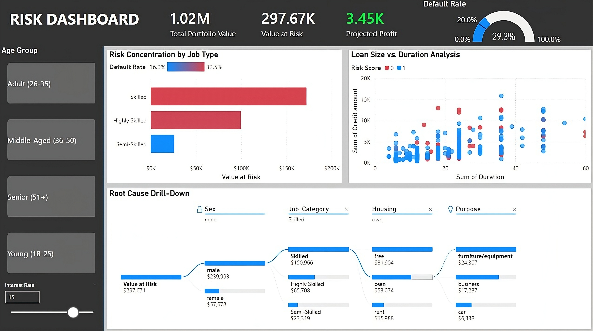

# 🏦 Credit Risk Oversight System

> **A dual-stream analytics platform combining descriptive BI (Power BI) and predictive AI (Streamlit) to optimize loan approval decisions.**



## 📌 Executive Summary
Managing a $3.2M subprime lending portfolio requires balancing risk with opportunity. Traditional manual reviews led to a **30% default rate**. This project deploys a two-stage solution:
1.  **Strategic Oversight (Power BI):** A dashboard to identify high-risk segments (e.g., "Skilled Workers") and simulate profitability scenarios.
2.  **Operational Action (Streamlit):** A machine learning web app allowing loan officers to score new applicants in real-time with **77% accuracy**.

---

## 🛠 System Architecture

The project is structured into two distinct pipelines:

### 1. The Analytics Pipeline (Business Intelligence)
* **Goal:** Root cause analysis of historical defaults.
* **Tech:** Python (Pandas) → Power BI (DAX, Decomposition Trees).
* **Key Output:** Discovered that **Highly Skilled Workers** have a **34.5% default rate** compared to **28% for Semi-Skilled workers** (+23% risk increase), contradicting traditional credit assumptions.

### 2. The Predictive Pipeline (Machine Learning)
* **Goal:** Real-time risk scoring for new applicants.
* **Tech:** Scikit-Learn (Extra Trees Classifier) $\rightarrow$ Streamlit.
* **Performance:** The **Random Forest** model achieved the highest stability, while **Extra Trees** was selected for production speed.

| Model | Accuracy | Status |
|-------|----------|--------|
| **Random Forest** | **77.0%** | 🏆 Best Performer |
| Extra Trees | 74.5% | ⚡ Deployed (Low Latency) |
| XGBoost | 73.5% | |
| Decision Tree | 70.5% | Baseline |

---

## 📂 Repository Structure

```text
CreditRisk/
├── Content/
│   ├── data/
│   │   ├── raw/
│   │   │   └── german_credit_data.csv          # Original dataset (1,000 applications)
│   │   └── Processed/
│   │       ├── german_credit_data_powerbi.csv  # Cleaned data with business labels
│   │       └── data_dictionary_powerbi.csv     # Column documentation
│   ├── notebooks/
│   │   ├── powerbi_data_prep.ipynb             # ETL Pipeline (cleaning & feature engineering)
│   │   └── analysis_model.ipynb                # ML Training & EDA
│   ├── Models/
│   │   ├── extra_trees_credit_model.pkl        # Production model (74.5% accuracy)
│   │   ├── Sex_encoder.pkl                     # Categorical encoders
│   │   ├── Housing_encoder.pkl
│   │   ├── Saving accounts_encoder.pkl
│   │   ├── Checking account_encoder.pkl
│   │   └── target_encoder.pkl
│   ├── App/
│   │   └── app.py                              # Streamlit Web Application
│   └── assets/
│       └── upscalemedia-transformed.jpeg       # Dashboard screenshot
├── .gitignore
└── README.md
